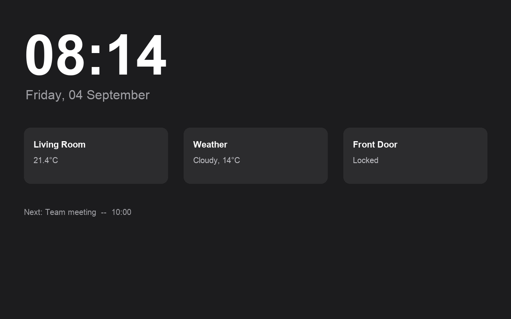
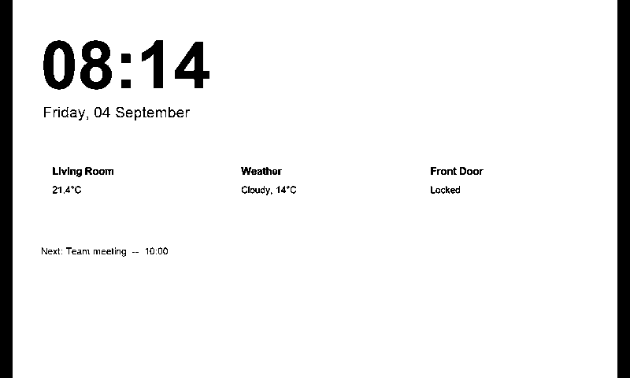

# E-Ink Dashboard Mirror

Mirror any Home Assistant dashboard onto a Waveshare 7.5" e-Paper panel — no ESPHome, no on-device rendering, no runtime image decoding. A Home Assistant add-on does all the work (screenshot the dashboard, convert to black/white, serve a file); a small ESP32 firmware just downloads that file over WiFi and paints it.

| Real dashboard (dark theme, wrong aspect ratio) | What ends up on the panel |
|---|---|
|  |  |

*(Synthetic example dashboard — not a real user's data.)*

## Why it's built this way

Two more obvious approaches exist and both have real problems on real hardware:

- **ESPHome's `online_image` + runtime decode** — the natural first choice, but on a plain ESP32 (no PSRAM) this is a documented, reproducible source of image corruption: not enough free heap for the PNG decompression buffer once WiFi/API/mDNS overhead is accounted for.
- **Compile a new firmware image per update, OTA-push it** — works, but means a full ESPHome build + flash cycle (tens of seconds to minutes) for every dashboard change, and ties image quality to ESPHome's generic register-LUT waveform, which turned out to be genuinely unreliable on real panels (see the driver repo below).

This project's approach: render entirely off-device (a real headless browser, not a memory-constrained microcontroller doing image decoding), reduce to a plain byte format with zero decode step, and let the ESP32's only job be "download a file, show it." The panel's own factory-calibrated waveform (not a generic host-supplied one) is what actually gets a clean, speckle-free result — see [waveshare-7in5-v2-esp32-fix](https://github.com/DSchreyer/waveshare-7in5-v2-esp32-fix) for that whole story if you're curious or hitting display-quality issues yourself.

## Architecture

```
┌─────────────────────────────┐      ┌──────────────────────────┐
│  Home Assistant add-on      │      │  ESP32 firmware          │
│  (this repo: addon/)        │      │  (this repo: firmware/)  │
│                              │      │                          │
│  headless Chromium           │      │  WiFi HTTP GET, on a     │
│    screenshots your          │      │  fixed interval          │
│    dashboard URL             │      │                          │
│           ↓                  │      │           ↓              │
│  fit + threshold + invert    │      │  content-hash check      │
│           ↓                  │──────▶  (skip if unchanged)     │
│  packed .bin written to      │ HTTP │           ↓              │
│  /config/www/                │      │  Epd::DisplayFrame()     │
│                              │      │  (OTP waveform driver)   │
└─────────────────────────────┘      └──────────────────────────┘
```

Multiple physical panels are supported — each is a named "device" in the add-on (its own dashboard URL, capture size, fit mode, refresh interval), with its own output file, and its own firmware build (`DEVICE_NAME` set at flash time).

## Get started

1. **[addon/](addon/)** — install the Home Assistant add-on, set up `trusted_networks`, configure your first device through its web UI. Start here.
2. **[firmware/](firmware/)** — wire up and flash the ESP32.

Both directories have their own README with the specifics.

## What's in each half

- `addon/` — Python (Flask), runs as a Home Assistant add-on. Playwright-driven Chromium screenshot → Pillow-based fit/threshold/invert → raw 1-bit packing → written to `/config/www/`. Has its own ingress web UI for live preview/config without needing an add-on restart to apply changes.
- `firmware/` — C++ (Arduino/ESP32, PlatformIO). WiFi fetch loop + the Waveshare panel driver (`Epd` class) with the confirmed-working OTP-waveform fix already applied.

## License

MIT — see [LICENSE](LICENSE). The vendored Waveshare driver files (`firmware/src/epd7in5_V2.*`, `epdif.*`) retain their original Waveshare copyright header.
